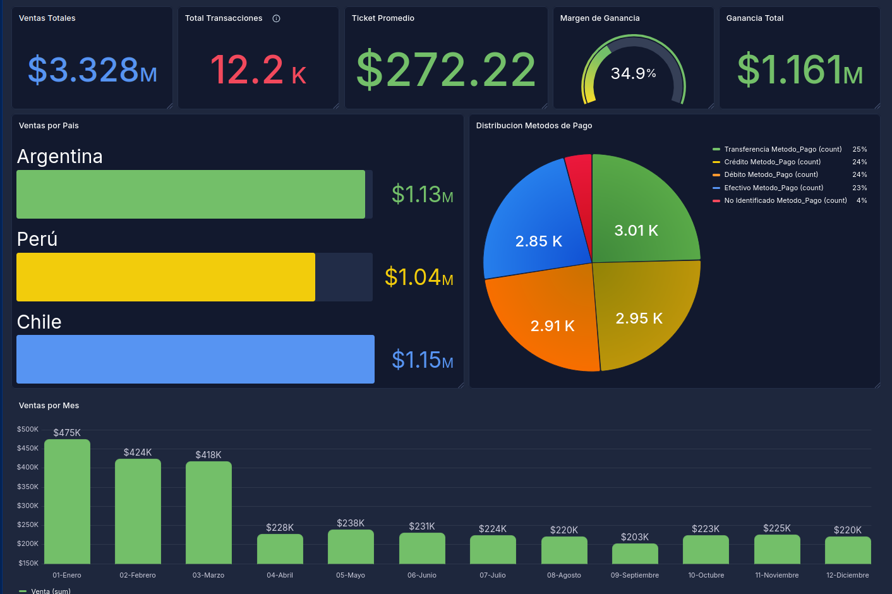

# 📊 Trabajo Integrador: Análisis de Datos con Python

**Tecnicatura Universitaria en Programación - UTN FRM**

## 👥 Integrantes

- **Mercado, Leandro**
- **Ramirez, Rodrigo**

**Docente:** Cinthia Rigoni  
**Fecha de Entrega:** 26/06

---

## ❓ Preguntas de Negocio

1.  **¿Qué categorías de productos dejan mayor margen de ganancia por país?**
2.  **¿El método de pago influye en la cantidad total de productos comprados y el total gastado?**
3.  **¿Cuál es el método de pago que domina las transacciones de alto valor en cada país y cómo influye esto en la venta total mensual?**
4.  **¿Hay ciudades en cada país donde la diferencia entre el costo de los productos y el precio de venta sea significativamente menor, afectando la rentabilidad?**

---

## 🗺️ Hoja de Ruta del Proyecto

### ✅ Hito 1: Adquisición y Planteo

- [x] Selección y carga de dataset (+15,000 registros)
- [x] Definición de objetivos estratégicos y preguntas de negocio

### ✅ Hito 2: ETL y Feature Engineering

- [x] **Calidad de Datos**: Limpieza de nulos y tratamiento de _outliers_ (Método IQR)
- [x] **Ingeniería de Atributos**: Creación de `Ganancia_Bruta`, `mes_texto` e `Indice_Constancia`
- [x] **Normalización**: Redondeo financiero y estandarización de categorías de texto

### ✅ Hito 3: Visualización Dinámica

- [x] Implementación de análisis exploratorio (EDA) con Seaborn
- [x] Construcción de narrativa de datos e insights

### ✅ Hito 4: Dashboard Interactivo

- [x] Dashboard en **Streamlit** con filtros dinámicos (fecha, país, categoría, método de pago, índice de constancia)
- [x] KPIs en tiempo real: venta total, ganancia bruta, transacciones, ticket promedio
- [x] 6 gráficos interactivos (Plotly): evolución mensual, ventas por categoría, top 10 productos, ventas por país, distribución por método de pago, ventas por tipo de cliente

### ✅ Hito 5: Informe de Gestión

- [x] Diagnóstico final y propuestas basadas en evidencia de datos
- [x] Documento: [`informe_gestion.md`](informe_gestion.md)

---

## 📊 Dashboards

### Tablero de Grafana



### Dashboard Streamlit

Dashboard interactivo desarrollado con **Streamlit** + **Plotly**, que consume `data/dataset_limpio.csv`.

**Ejecución:**

```bash
conda run -n ciencia_datos streamlit run dashboard/app.py
```

**Filtros:** fecha, país, categoría, método de pago, índice de constancia.  
**KPIs:** venta total, ganancia bruta, transacciones, ticket promedio.  
**Gráficos:** evolución mensual, ventas por categoría, top 10 productos, ventas por país, distribución por método de pago, ventas por tipo de cliente.
